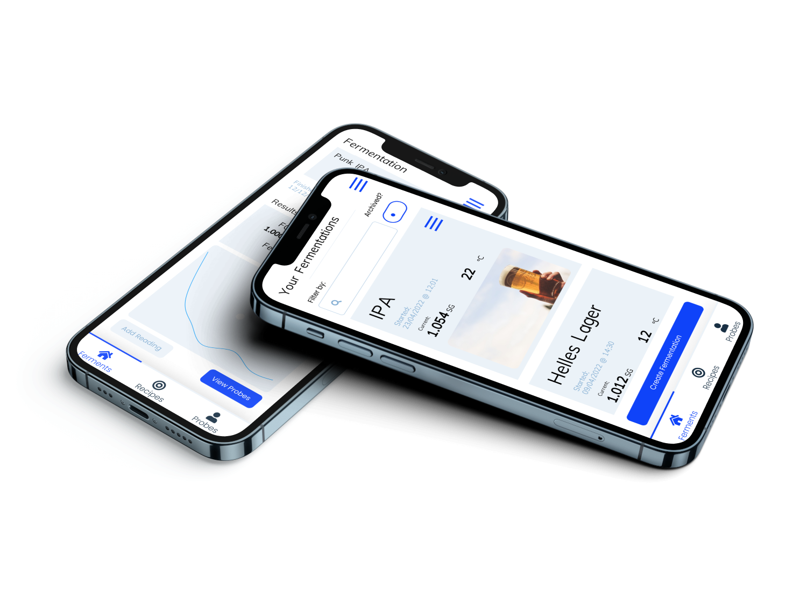

# BREWDICT.io

*Less time waiting, more time brewing.*

---

BREWDICT.io is a mobile app designed for
homebrewers and professional brewers alike
to create, track and monitor the progress of
their fermentation. The aim of this app is to
help brewers understand when their fermentation
will be done based using a machine learning regression model off of data specifically recorded
about their fermentation. This will allow users
(especially professionals) to more accurately
predict when they have free fermenter space so
they can get brewing again.

## Features
- Style catalogue
- Recipe creator
- View other user's recipes
- Record fermentations progress
- Get accurate predictions as to fermentation length

## Future Developments
- [ ] iOS and Web app
- [ ] Recipe builder - ingredients, water profile and mash steps
- [ ] Recipe statistics
- [ ] TILT and iSpindel integration
- [ ] ML model transparency

Video showcase [here]().
